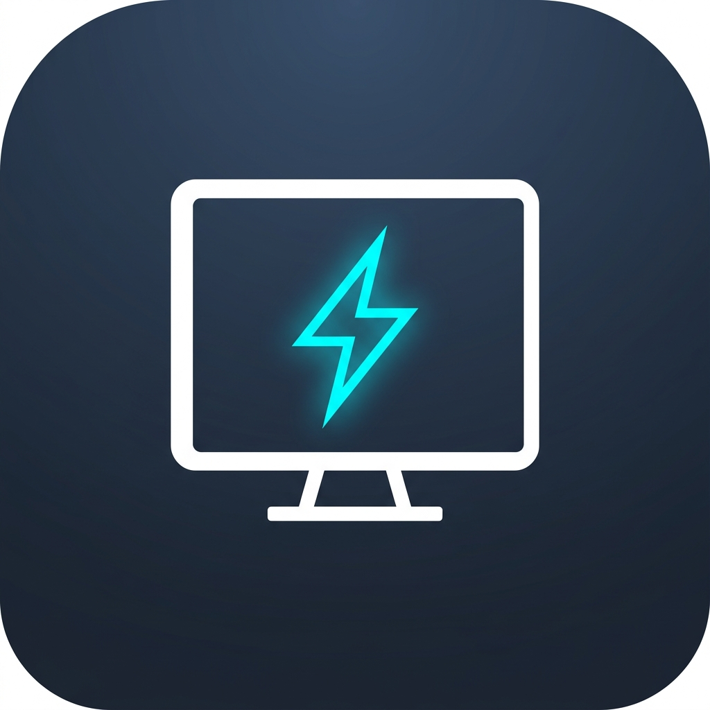
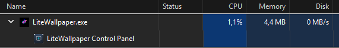
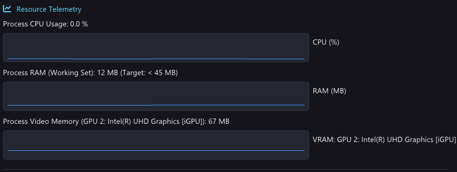

<div align="center">

  

  # LiteWallpaper

  **Ultra-Lightweight, High-Performance Animated Video Wallpaper Engine for Windows**

  [](LICENSE)
  [](https://en.wikipedia.org/wiki/C%2B%2B20)
  [](https://learn.microsoft.com/windows/win32/direct3d11/direct3d-11-graphics)
  [](https://microsoft.com/windows)
  []()
  []()

  <p align="center">
    <i>Experience breathtaking live video wallpapers with virtually <b>zero impact</b> on system resources, battery life, and gaming performance.</i>
  </p>

</div>

---

## ⚡ Performance Benchmarks

LiteWallpaper is engineered in native **C++20** and **DirectX 11 (D3D11VA)** from the ground up, completely eliminating web runtimes (Chromium/CEF/Electron/WPF) to achieve an unprecedented low-resource footprint:

| Metric | 🚀 **LiteWallpaper** | Lively Wallpaper | Wallpaper Engine |
| :--- | :---: | :---: | :---: |
| **RAM (Working Set)** | **`4.4 MB - 12 MB`** | ~350 MB - 600 MB | ~250 MB - 350 MB |
| **CPU Usage** | **`0.0% - 1.1%`** | ~3% - 8% | ~2% - 5% |
| **dGPU Power Saving** | 🟢 **Deep Sleep (0% NVIDIA)** | Variable | Variable |
| **Architecture** | **Native C++20 / DirectX 11** | C# / .NET / WinUI | C++ / CEF / Chromium |

### 📸 Real-World Telemetry

#### 1. Windows Task Manager Footprint
> *LiteWallpaper running with active 1080p hardware-accelerated video playback at only **4.4 MB RAM** and **1.1% CPU**:*

<div align="center">
  
</div>

#### 2. In-App Real-Time Hardware Telemetry
> *Telemetry dashboard demonstrating Intel UHD Graphics (iGPU) hardware decoding with **0.0% CPU overhead**:*

<div align="center">
  
</div>

---

## ✨ Key Features

- 🎬 **Universal Video Playback**: High-efficiency hardware decoding for MP4, WebM, MKV, AVI, and MOV via FFmpeg D3D11VA (H.264 / HEVC / AV1 / VP9).
- 🔋 **Smart Dual-GPU Power Routing**: Automatically renders on the energy-efficient **Integrated GPU (iGPU / Intel UHD / AMD APU)**, leaving discrete NVIDIA/AMD gaming GPUs in complete deep sleep (0% load).
- 🎮 **Intelligent Power Governor**:
  - **Auto-Pause on Fullscreen**: Automatically suspends playback and video decoding when a fullscreen game or application is active.
  - **Smart Resource Governor (Gaming & Heavy Load Sleep)**: Automatically puts wallpaper into Deep Sleep (0% CPU, 0 MB VRAM) when overall system RAM or GPU VRAM reaches threshold (e.g. $\ge 80\%$) during windowed gaming, and auto-resumes when memory pressure drops.
  - **Battery Saver Mode**: Dynamically reduces frame rates or pauses when running on laptop battery.
  - **Workstation Lock Detection**: Instantly sleeps when Windows is locked (`Win + L`) to preserve power.
- ⚡ **Integrated 1080p Video Optimizer**: Built-in GPU pre-scaler that converts heavy 4K/high-bitrate videos into lightweight 1080p NV12 hardware streams, saving up to ~75% GPU load.
- 🖥️ **Multi-Monitor & Desktop Selection**: Choose whether wallpapers play across all monitors or selectively target specific screens.
- 🎨 **Adaptive Responsive Control Panel**: Fully responsive Dear ImGui dark-themed control center with real-time hardware telemetry and 0ms instantaneous tray restoration.

---

## 🚀 Getting Started

### Portable Version (No Installation Required)
1. Download the latest `LiteWallpaper-Portable.zip` from [Releases](https://github.com/f4rdani/LiteWallpaper/releases).
2. Extract the archive to any folder of your choice.
3. Run `LiteWallpaper.exe`.
4. Drag & drop any video into the **Wallpaper Gallery**, click **Play**, and enjoy!
5. Close the Control Panel to minimize LiteWallpaper to the system tray (`~4-12 MB RAM`).

---

## 🛠️ Building from Source

### Prerequisites
* Windows 7 SP1 or newer (64-bit)
* Visual Studio 2022 / MSVC (C++20 toolset)
* [CMake 3.20+](https://cmake.org/download/)
* [vcpkg](https://github.com/microsoft/vcpkg)
* FFmpeg 64-bit Shared Developer SDK

### Build Steps

```powershell
# 1. Install dependencies via vcpkg
vcpkg install nlohmann-json:x64-windows mimalloc:x64-windows imgui[docking-experimental,win32-binding,dx11-binding]:x64-windows

# 2. Clone repository
git clone https://github.com/f4rdani/LiteWallpaper.git
cd LiteWallpaper

# 3. Configure & Compile (Release Mode)
cmake -B build -S . -DCMAKE_TOOLCHAIN_FILE="C:/vcpkg/scripts/buildsystems/vcpkg.cmake"
cmake --build build --config Release
```

The compiled portable binary will be generated at `build/Release/LiteWallpaper.exe`.

---

## 📖 Architecture & Documentation

For in-depth architectural details, DirectX 11 presentation pipeline, IPC protocol specifications, and contributing guidelines, please refer to **[DEVELOPMENT.md](DEVELOPMENT.md)**.

---

## 📄 License

This project is licensed under the **GNU General Public License v3.0 (GPL-3.0)**. See the [LICENSE](LICENSE) file for more details.
